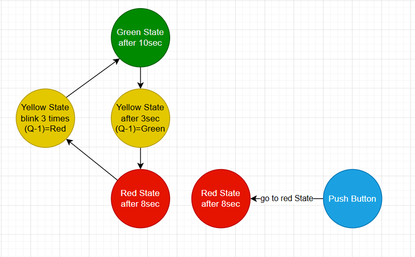

# 🚦 Traffic Light State Machine Example

This project demonstrates a **state machine implementation** for a traffic light system using the **PAT OS framework**.  
It shows how **state transitions** can be modeled efficiently in embedded systems with **event-driven** design and **non-blocking logic**.

---

## 🧠 Overview

Each traffic light phase is implemented as a separate state:

- **Red State** – Stop condition, active for 8 seconds
- **Yellow State** – Transition phase, blinking 3 times or 3-second delay depending on direction
- **Green State** – Go condition, active for 10 seconds
- **Push Button Event** – Forces immediate transition to Red State

---

## 🗺️ State Machine Diagram

Below is the visual representation of the state flow:



---

## ⚙️ Code Example

The following code defines the full state machine logic using `PAT_OS`:

```cpp
#include <Arduino.h>
#include "PAT_OS.h"

// Traffic Light State Machine Example
// -----------------------------------

void setup(void) {
    os.init();

    os.sm["trafficLight"].StartState("Red", []() {
        println("Red");
        delay(3000);
        os.sm["trafficLight"].setNextState("Yellow");
    });

    os.sm["trafficLight"].addState("Yellow", []() {
        if (os.sm["trafficLight"].getState(Q_1) == "Red") {
            for (int i = 0; i < 3; i++) {
                print("Yellow"); delay(200);
                print("Off"); delay(200);
            }
            println("Yellow");
            os.sm["trafficLight"].setNextState("Green");
        } else if (os.sm["trafficLight"].getState(Q_1) == "Green") {
            println("Yellow");
            delay(1000);
            os.sm["trafficLight"].setNextState("Red");
        }
    });

    os.sm["trafficLight"].addState("Green", []() {
        println("Green");
        delay(3000);
        os.sm["trafficLight"].setNextState("Yellow");
    });

    os.sm["trafficLight"].onEnterState([](const String &stateName) {
        Serial.println("\n>>> Entering state: " + stateName);
    });

    os.sm["trafficLight"].onExitState([](const String &stateName) {
        Serial.println("<<< Exiting state: " + stateName + "\n");
    });

    os.sm["trafficLight"].setErrorHandler([](const String &errorMessage) {
        Serial.println("Error: " + errorMessage);
    });
}

void loop(void) {
    if (botton_is_Pushed()) os.sm["trafficLight"].setNextState("Red");
    os.sm["trafficLight"].update();
    delay(100);
}
```
